## Introduction

It's a straightforward to-do list where you can enter tasks to be completed either on a specific date or without a date. By clicking on a task, you can view details such as its completion status, due date (if applicable), and last update timestamp. The app was developed using Laravel on Docker. For the visual design, I utilized Tailwind CSS to style the views. Additionally, I implemented some JavaScript scripts to toggle the visibility of task details upon clicking.

## Home page

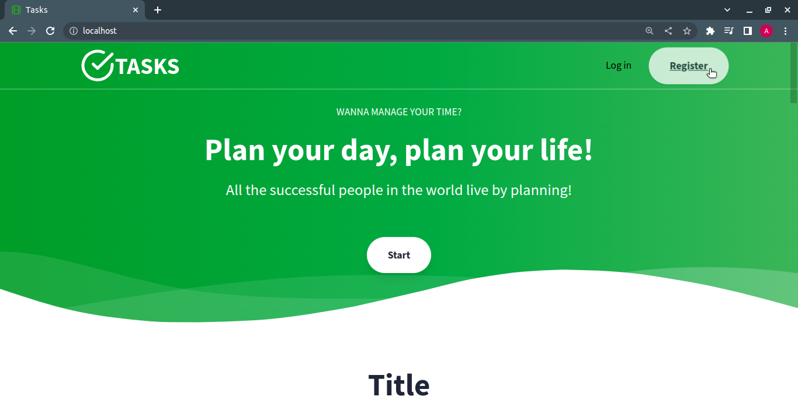

## Register form

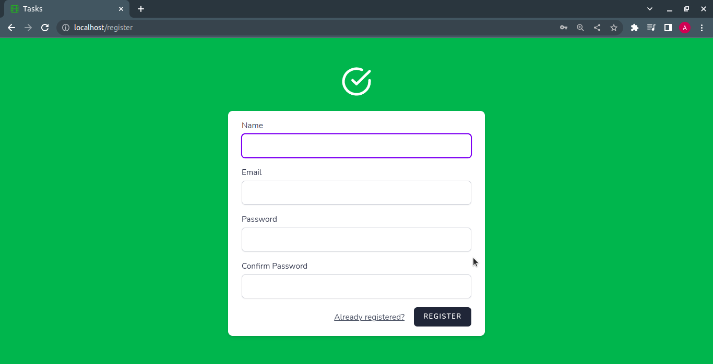

## Login form

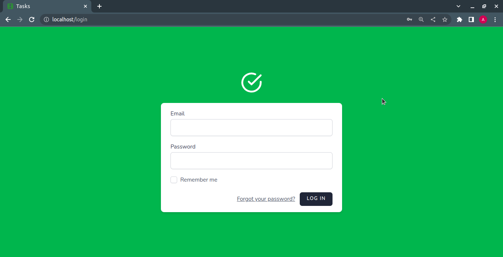

## All tasks

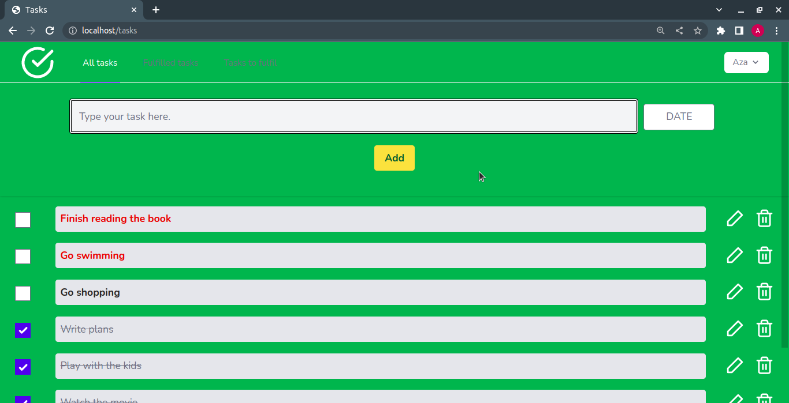

## Task details

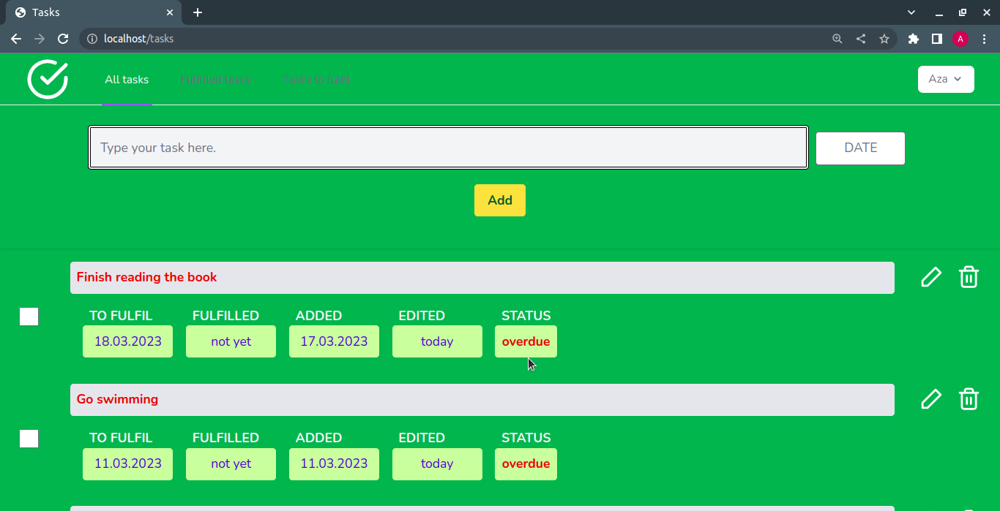

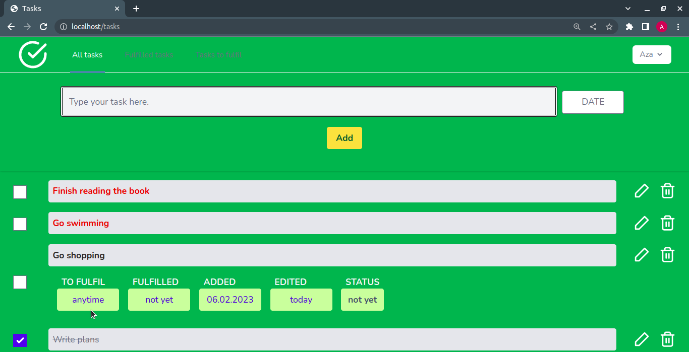

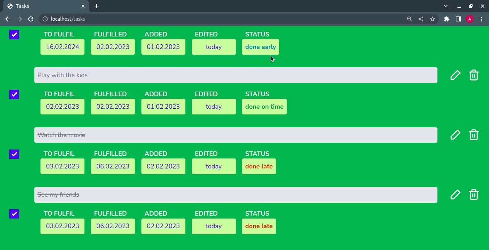

## Adding a new task

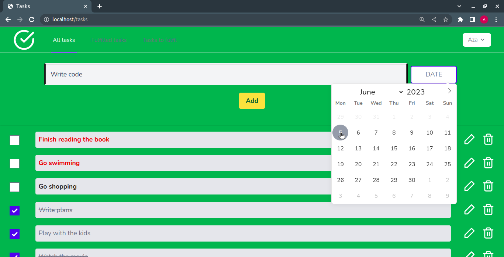

## Fulfilled tasks

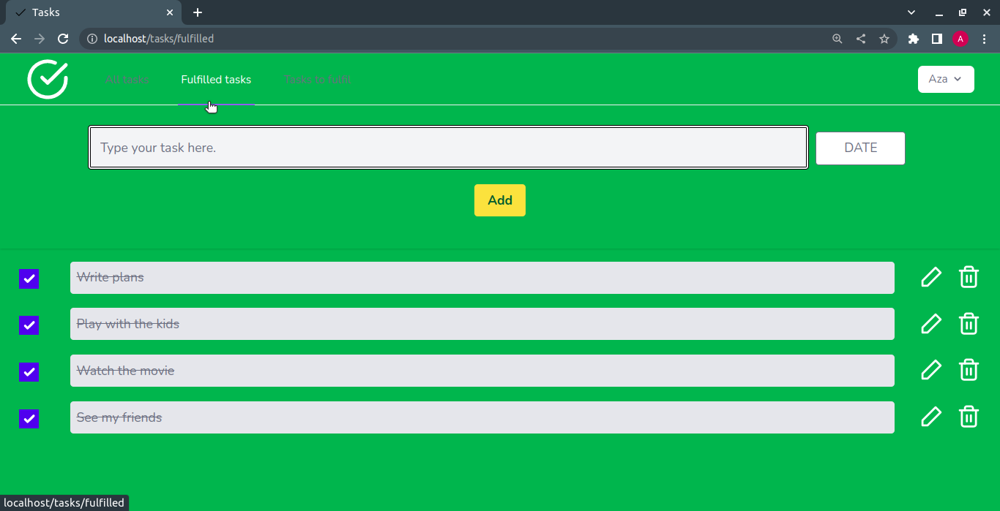

## Tasks to fulfil

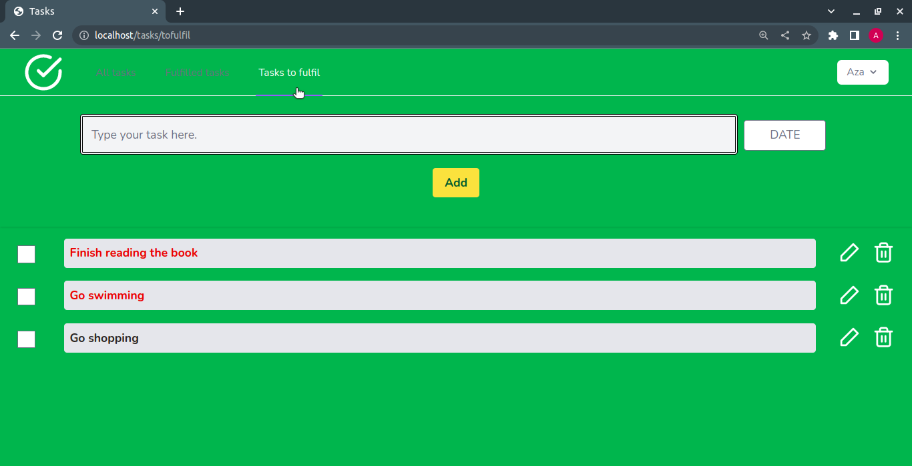

## Updating a task

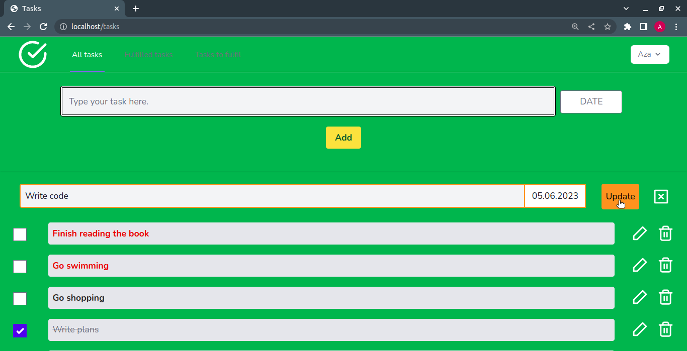

## Smartphone views

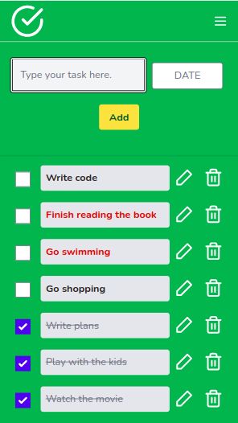

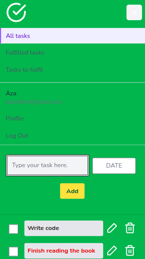

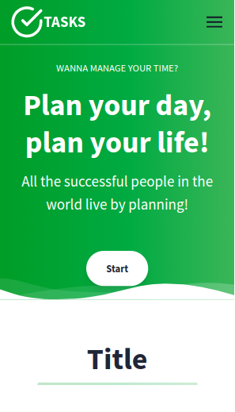
